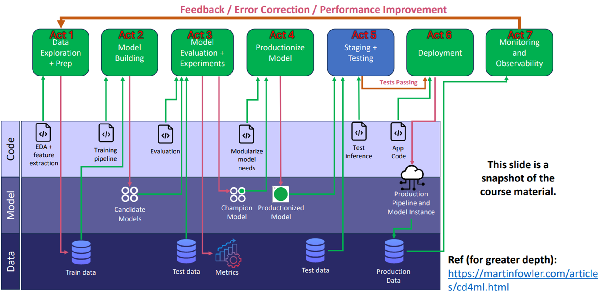

# NYC Yellow Taxi Fare Prediction & Analysis 🚕
### *A Comprehensive Machine Learning & MLOps Pipeline*


This repository contains a modular, end-to-end Machine Learning pipeline developed to estimate NYC Yellow Taxi fares, analyze data and concept drift over time, and deploy a champion predictive model.

---

## 👥 Authors & Team
*   **Netanel Rahum** — [@netanelr6](https://github.com/netanelr6)
*   **Omer Gabay** — [@gabao-lgtm](https://github.com/gabao-lgtm)

---

## 🎓 Academic Context
This project was developed as part of the **Data Science Methods and Applications (DSMA)** course (2026) at Ben-Gurion University of the Negev (BGU).

We would like to express our deep appreciation and thanks to our lecturer, **[Trivikram Muralidharan](https://github.com/trivikram-muralidharan)**, for his guidance, support, and for delivering an outstanding and inspiring course.

---

## 📁 Key Project Files & Documents

For quick access, here are the primary assets, reports, and notebooks of the project:
*   📄 **[pipeline.py](pipeline.py)** - The core orchestration script for the ML pipeline (Acts 1-6).
*   📁 **[notebooks/01_eda_trip_fare.ipynb](notebooks/01_eda_trip_fare.ipynb)** - The Exploratory Data Analysis (EDA) notebook.
    *   *(Cloud Alternative: Run directly on [Google Colab / Drive Version](https://drive.google.com/file/d/16Sphd6PwAB3eKw6orKDPcFnFlkJHqMkL/view?usp=sharing))*
*   📄 **[notebooks/Trip Fare Estimation - final report.pdf](notebooks/Trip%20Fare%20Estimation%20-%20final%20report.pdf)** - The final project report (PDF).
*   📄 **[notebooks/Assignment_Choice_2-NYC_TLC_total_fare_amount_prediction.pdf](notebooks/Assignment_Choice_2-NYC_TLC_total_fare_amount_prediction.pdf)** - The BGU course project instructions & guidelines.

---

## 🚀 Setup & Execution (For the Lecturer)

Follow these step-by-step commands to clone the repository, prepare your virtual environment, execute the evaluation pipeline, and launch the dashboard.

### 1. Clone & Navigate to the Project
Open your terminal and run the following commands to download the repository and enter the directory:
```bash
git clone https://github.com/netanelr6/nyc-tlc-project-dsma-course.git
cd nyc-tlc-project-dsma-course
```

### 2. Configure Environment Variables (Optional)
> [!TIP]
> **This step is optional.** The project runs successfully without any manual configuration or a `.env` file. If no Weights & Biases (W&B) API key is configured, the pipeline automatically runs in local/offline mode (or asks you to run offline in interactive terminal sessions) so that no login is required.
> 
> If you prefer to explicitly disable online tracking and suppress any interactive prompts, you can create a `.env` file:
> 
> *   **On Windows (CMD):**
>     ```cmd
>     copy .env.example .env
>     ```
> *   **On macOS / Linux / Git Bash:**
>     ```bash
>     cp .env.example .env
>     ```
> 
> Verify or set the following variable inside the newly created `.env` file:
> ```env
> WANDB_MODE=disabled
> ```

### 3. Initialize & Activate the Virtual Environment
Set up a clean virtual environment and activate it:
```bash
# Create the virtual environment
python -m venv venv

# Activate the environment:
# Option A: Windows (Command Prompt)
call venv\Scripts\activate.bat

# Option B: Windows (PowerShell)
.\venv\Scripts\Activate.ps1

# Option C: macOS / Linux / Git Bash
source venv/bin/activate
```

### 4. Install Project Dependencies
With the virtual environment activated, install all required packages:
```bash
pip install -r requirements.txt
```

### 5. Run the Evaluation Pipeline
Execute the automated batch runner script:
```bash
run_evaluation_pipeline.bat
```
> [!NOTE]
> This batch script verifies your active environment and automatically triggers the following pipeline sections:
> - **Act 1** — Data Prep, Outlier Cleaning, Validation, and Feature Store Creation.
> - **Act 5** — Staging & Testing Hold-out Evaluation (running inference and calculating performance metrics on reserved 2026 data).
> - **Act 6** — Deployment Asset Verification.
> - Launches the **Streamlit Web Application** hosting the predictor.

*(If you are running on macOS or Linux, you can execute these acts manually via CLI instead of the batch file)*:
```bash
python pipeline.py --act 1
python pipeline.py --act 5
python pipeline.py --act 6
streamlit run streamlit_app.py
```

### 6. Access the Interactive Web Dashboard
Once the Streamlit server has launched, it will print connection links. If it doesn't open automatically in your web browser, navigate to:
🔗 **[http://localhost:8501](http://localhost:8501)**

The dashboard allows you to:
*   Configure custom pickup/dropoff taxi zones, trip distances, and scheduled ride times.
*   Get instant fare estimations generated by the champion Gradient Boosted Decision Tree (GBDT) model.
*   View the journey plotted dynamically in a 3D Pydeck arc overlay on a dark map.

### 7. Review the EDA Notebook
The Exploratory Data Analysis (EDA) notebook, containing extensive visualizations, outlier filtering decisions, and key domain observations, is located at:
📁 **[notebooks/01_eda_trip_fare.ipynb](notebooks/01_eda_trip_fare.ipynb)**

*   **Cloud Run Alternative (Google Colab):** If you prefer to run the EDA analysis interactively in the cloud without downloading anything locally, you can open and execute the standalone notebook via Google Drive:
    🔗 **[Open Standalone EDA in Google Colab](https://drive.google.com/file/d/16Sphd6PwAB3eKw6orKDPcFnFlkJHqMkL/view?usp=sharing)**

---

## 🛠️ Repository Structure

*   📁 **`data/`** - Raw and processed datasets (Git-ignored, automatically downloaded by pipeline).
*   📁 **`notebooks/`** - Jupyter notebooks and coordinate lookup files:
    *   `01_eda_trip_fare.ipynb` - The primary Exploratory Data Analysis notebook.
    *   `taxi_zone_lookup.csv` - Coordinates and borough mappings for NYC Taxi Zones.
*   📁 **`models/`** - Stores saved baseline, engineered, and tuned model artifacts.
*   📁 **`outputs/`** - Contains output assets, drift reports, and LLM evaluations:
    *   `outputs/plots/` - Feature importance and evaluation charts.
    *   `outputs/gemini_drift_analysis.md` - Automated drift reports analyzed by the Gemini API.
    *   `outputs/evidently_drift_report.html` - HTML report from Evidently AI.
*   📁 **`src/`** - Modular codebase:
    *   `download_data.py` - Script to fetch raw TLC Parquet data (2024-2026).
    *   `validation.py` - Validation checks against strict schemas.
    *   `cleaning.py` - Outlier filtering and noise removal.
    *   `features.py` - Feature engineering pipelines.
    *   `models.py` - Classifier training code (Ridge, RF, GBDT, Neural Nets).
    *   `evaluation.py` - Evaluation metrics and champion model selection.
    *   `tuning.py` - Grid/random parameter search.
    *   `drift_detection.py` & `drift_detection_evidently.py` - MLOps data/concept drift monitoring.
    *   `drift_mitigation.py` - Model mitigation & fine-tuning logic.
    *   `gemini_analyzer.py` - LLM analysis interface for drift reports.
    *   `error_analysis.py` - Prediction residual and error slicing checks.
    *   `versioning.py` - Artifact logging to Weights & Biases.
*   📄 **`pipeline.py`** - Main orchestration script managing the execution lifecycle.
*   📄 **`streamlit_app.py`** - Streamlit application logic.

---

## 📊 Pipeline Stages (The "Acts")

The orchestration workflow is divided into 6 distinct stages ("Acts"), mapping the entire ML engineering lifecycle from raw ingestion to model staging and deployment.

### Workflow Diagram


For details on each stage executed by `pipeline.py`:

| Stage | Name | Description |
| :--- | :--- | :--- |
| **Act 1** | Data Prep & Features | Downloads taxi datasets, runs validation rules, cleans outliers, and builds feature stores. |
| **Act 2** | Model Training & Tuning | Trains candidate models (Ridge, RF, GBDT, NN) and executes hyperparameter sweeps (Random & Grid search) using W&B. |
| **Act 3** | Champion Evaluation | Evaluates model families, selects the Champion (based on MAE), logs performance summaries, and saves feature importance plots. |
| **Act 4** | Production & Drift | Runs Evidently AI reports comparing training data vs. recent inference data. Passes drift statistics to the Gemini API for automatic risk assessment. |
| **Act 5** | Staging & Testing | Performs final inference and error evaluation on reserved 2026 hold-out datasets. |
| **Act 6** | Deployment Prep | Verifies that all production artifacts exist and displays the launch parameters. |

---

## 💻 Running the Streamlit App Manually

If you have already run the pipeline and only want to restart the web interface:
1. Activate the virtual environment.
2. Run the batch launcher:
   ```bash
   run_streamlit.bat
   ```
   *Or manually execute:*
   ```bash
   streamlit run streamlit_app.py
   ```
